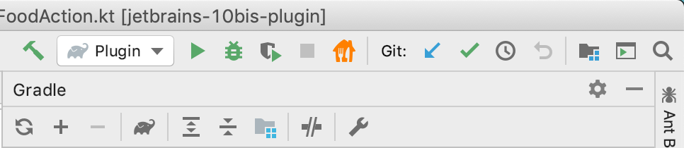
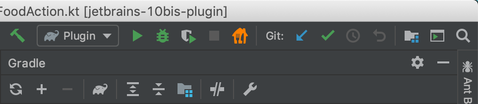
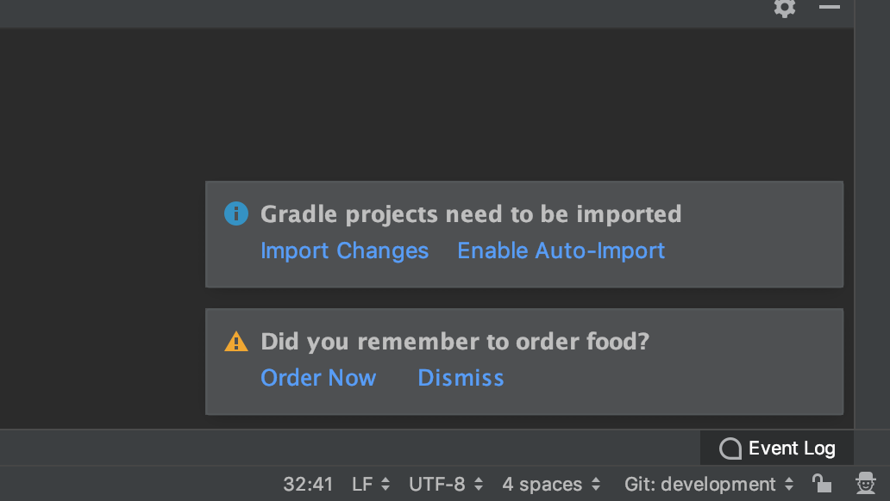

# TenBis (10bis) Plugin for All Jetbrains IDEs

Yup.

It's a plugin for showing the a TenBis button - inside the toolbar of your favorite JetBrains IDE.

Clicking the button opens 10bis.co.il in your default browser.

### Todos
- [x] Push to Git
- [x] Submit to JetBrains Repo
- [x] Order Food Reminder
- [x] User Configurations
- [x] Add Installation Instructions

Here's the first article in the series
https://medium.com/@nadavfima/writing-your-first-intellij-ide-plugin-with-kotlin-d36fe65be87f

### Installation Instructions
Search for TenBis in the IntelliJ Plugins Marketplace inside your IDE or your browser.

### Light Theme

### Dracula Theme

### Order Reminder

